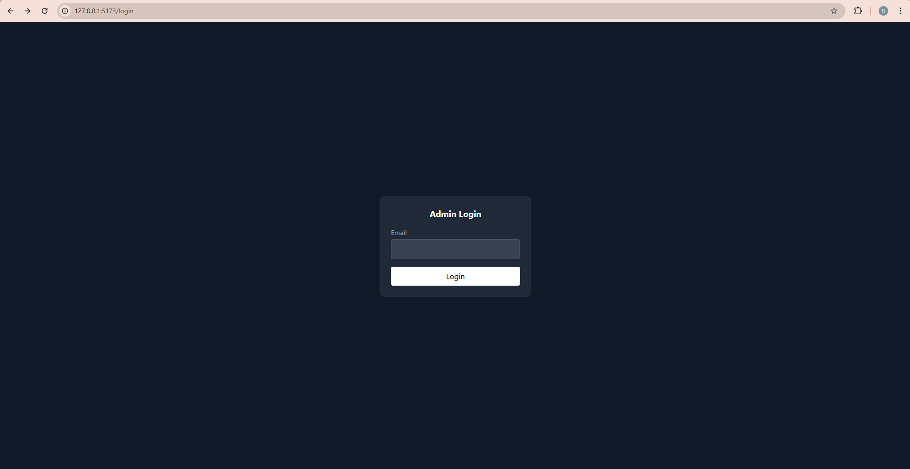
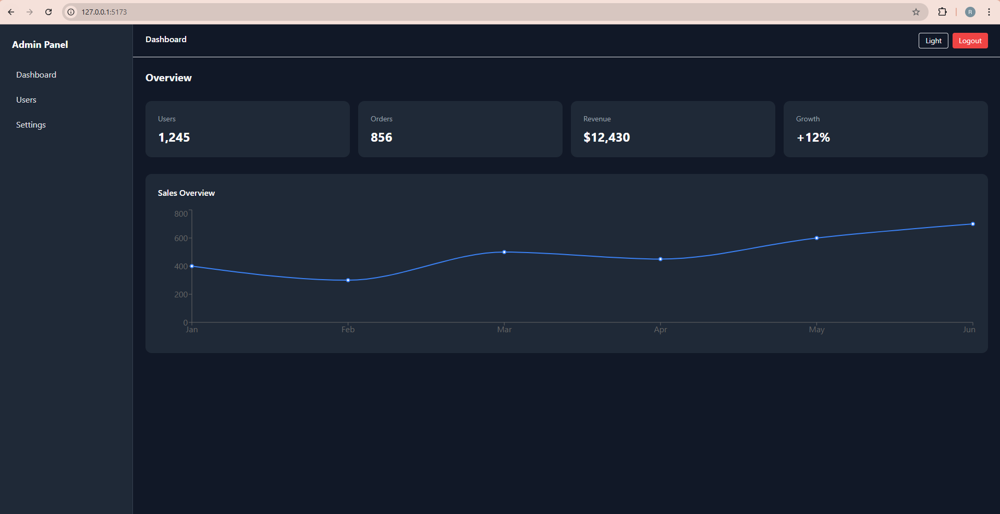
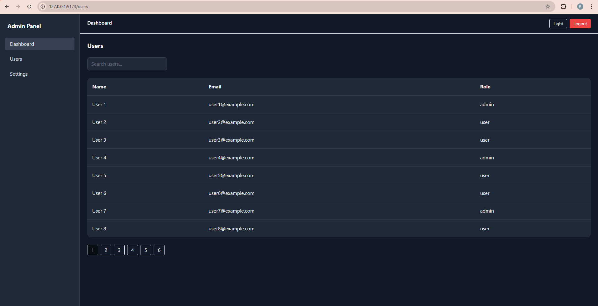
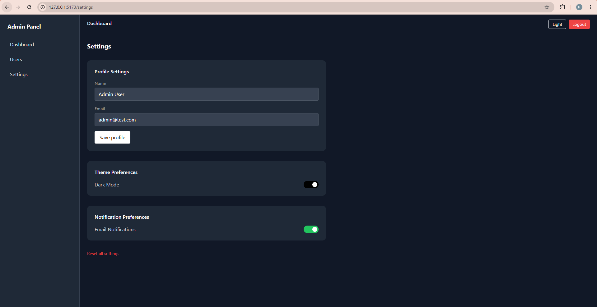
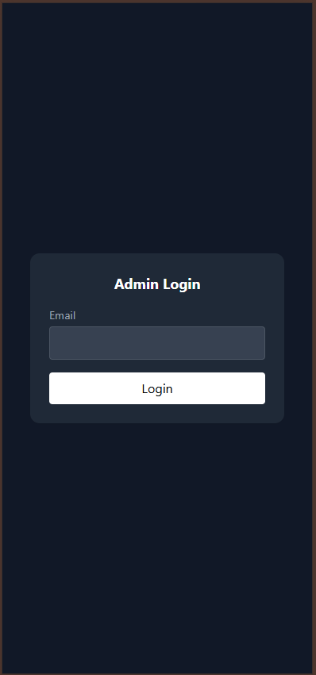
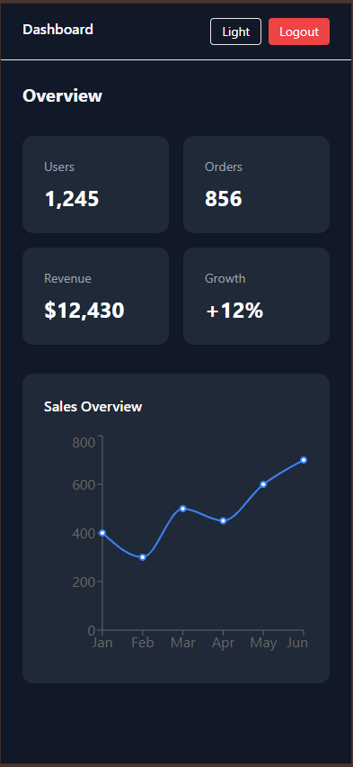
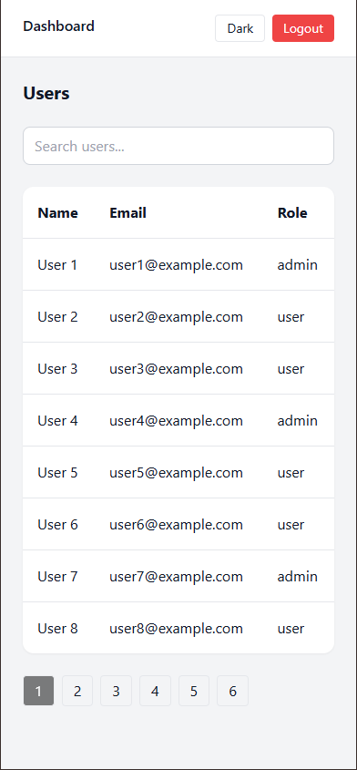
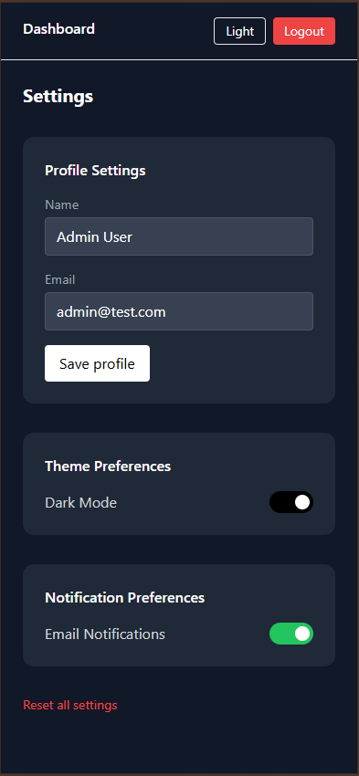

# 📊 Admin Dashboard
A production-style admin dashboard built with React, focusing on real-world frontend challenges such as authentication, role-based access control, 
async data handling, and polished user experience.

---

## 🚀 Live Demo
- 👉 Live: https://
- 👉 Portfolio: https://

---

## ✨ Features

- 🔐 Role-Based Access Control (RBAC) — Admin & User roles
- 🛡️ Protected Routes — unauthorized users are redirected
- 🧭 Role-Aware Navigation — UI adapts based on user role
- 🔄 Reusable Async Logic — custom hooks with loading, error & retry states
- 🦴 Skeleton Loaders — better perceived performance
- 🌙 Dark Mode — fully styled and accessible
- 📊 Charts & Analytics — visualized dashboard data
- 🔍 Search & Pagination — scalable data tables
- 💥 Error Boundaries — graceful app-level error handling
- 📱 Responsive Design — works across devices

---

## 🧰 Tech Stack
### Frontend
- React
- JavaScript (ES6+)
- React Router
- Tailwind CSS
- Recharts

### State & Logic
- React Hooks
- Context API
- Custom Hooks (useAsync)
- Role-Based Access Control (RBAC)

### UI / UX
- Responsive Design
- Dark Mode
- Skeleton Loaders
- Retry Mechanism
- Error Boundaries

### Tooling
- Vite
- Git & GitHub

---

## 🧠 What This Project Focuses On

This project is intentionally built to simulate real-world frontend scenarios, not just UI components:
- Managing async data with failure and recovery flows
- Enforcing authorization both at route and UI level
- Maintaining consistent UX with skeleton loaders and retries
- Structuring scalable React applications

---

## 📸 Screenshots
  
  
  
  
  
  
  
  

---

## 🔐 Demo Credentials
You can use the following credentials to explore different roles:
### Admin
```text
Email: admin@test.com
```
### User
```text
Email: user@test.com
```

---

## 📂 Project Structure
```text
src/
├── api/            # Mock API with delay & failure simulation
├── components/     # Reusable UI components
├── context/        # Auth & global state
├── hooks/          # Custom hooks (useAsync)
├── pages/          # Dashboard, Users, Settings
├── data/           # Mock data (Dashboard stats, sales and users data)
├── constants/      # Status & roles
```

---

## 🛠️ Getting Started Locally
```bash
# Clone repository
git clone https://github.com/yanorenzo624/admin-dashboard.git

# Install dependencies
npm install

# Start development server
npm run dev
```

---

## 📌 Future Improvements
- Persistent settings via backend
- Advanced analytics filters
- Unit & integration tests
- TypeScript migration

---

## ⭐ Final Note
This project is part of my frontend portfolio and reflects my approach to building maintainable, 
scalable, and user-focused React applications.

---
